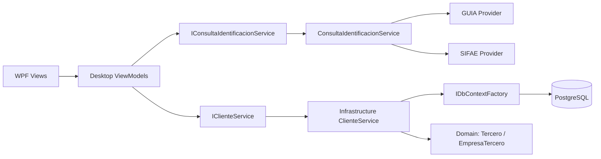
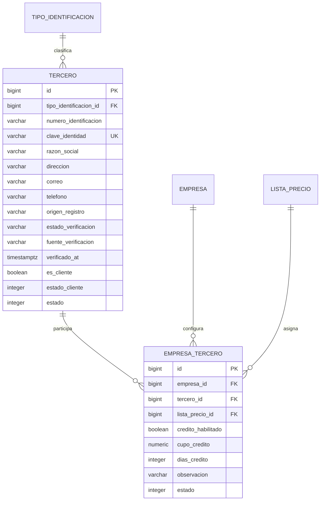
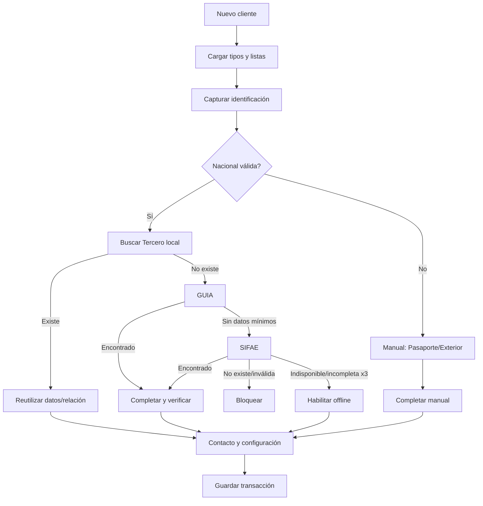

# Clientes V1

## 1. Estado del módulo

- Fecha de última validación: 2026-08-06.
- Rama: `dev`.
- Commit base de mantenimiento: `a12b57b3d197daee7588e9637f6b24614dcafdac`.
- Estado del árbol: con cambios previos sin confirmar; la mayor parte de Clientes está en archivos nuevos y todavía no pertenece al commit base.
- Build: correcto, 0 advertencias y 0 errores.
- Pruebas: 251 correctas en la solución; 0 fallidas y 0 omitidas, incluidas 5 contra PostgreSQL real.
- EF Core: `20260806153953_MakeClientRoleGlobal` aplicada en PostgreSQL Development y sin cambios pendientes de modelo.

Clientes V1 permite listar, buscar, filtrar, crear, reutilizar, editar, verificar, activar e inactivar un catálogo global de clientes. Identidad, contacto, rol y estado pertenecen a `Tercero`; lista de precios, crédito y observación pertenecen a la configuración `EmpresaTercero` de la empresa activa.

La arquitectura por capas, persistencia transaccional, integración GUIA/SIFAE, fallback y aislamiento de consultas están implementados. El mantenimiento añadió autorización empresarial en la frontera, identidad canónica con índice único, recarga segura al cambiar de empresa, concurrencia optimista, auditoría transaccional y pruebas relacionales de los invariantes compartidos de `Tercero`. Permanecen pendientes las pruebas automatizadas de WPF y servicios oficiales reales.

Evidencia comprobada mediante ejecución: restore, build, test y `dotnet ef migrations has-pending-model-changes`. Evidencia de repositorio: `git status`, rama y commit.

## 2. Objetivo funcional

El módulo administra clientes facturables sin duplicar identidades entre empresas. Permite obtener datos oficiales de cédula y RUC, registrar manualmente cuando corresponde, asignar lista de precios y crédito por empresa y conservar una misma persona como cliente o proveedor.

No incluye ventas, cartera operativa, cupos consumidos, saldos, historial de compras ni autorización por permisos específicos de Clientes.

Evidencia: `ClientesViewModel`, `ClienteFormViewModel`, `IClienteService` y `ClienteService`.

## 3. Decisiones confirmadas

- `Tercero` es global.
- No existe entidad ni tabla `Cliente`.
- El rol Cliente se expresa mediante `Tercero.EsCliente` y su estado mediante `Tercero.EstadoCliente`.
- `Tercero` no tiene `EmpresaId`; `EmpresaTercero` sí.
- Identidad, razón social, dirección, correo, teléfono y verificación son globales.
- Lista, crédito y observación son empresariales; rol y estado del cliente son globales.
- Consumidor Final es estructural, está protegido y no aparece en el catálogo editable.
- Pasaporte y Exterior se registran manualmente y la UI deriva `NoAplica`; la persistencia mantiene el workflow aprobado `PENDIENTE | VERIFICADO`.
- Un cliente nuevo siempre se crea activo; la activación/inactivación posterior se realiza desde el listado.
- El correo vacío se normaliza a `cliente@kontax.com`.

Evidencia confirmada mediante código: `Domain/Entities/Comercial`, `ComercialConfiguration`, `StructuralSeeder`, DTOs y `ClienteService`.

## 4. Arquitectura



Domain no depende de WPF ni EF. Application define contratos, DTOs y reglas puras. Infrastructure implementa persistencia y HTTP. Desktop contiene navegación, ViewModels, Views y mecánica de foco. No hay acceso a `KontaxDbContext` desde ViewModels ni repositorios adicionales.

Evidencia: proyectos `.csproj`, `App.xaml.cs`, `KontaxDbContext` y archivos indicados en la siguiente sección.

## 5. Inventario de archivos

### KONTAXPRO.Domain

- `Entities/Comercial/Tercero.cs`: identidad y contacto global.
- `Entities/Comercial/EmpresaTercero.cs`: configuración y vínculo interno por empresa.
- `Entities/Catalogos/TipoIdentificacion.cs`: catálogo SRI.

### KONTAXPRO.Application

- `Interfaces/IClienteService.cs`.
- `Interfaces/IConsultaIdentificacionService.cs`.
- `Models/Clientes/ClienteDtos.cs`.
- `Models/Interoperabilidad/ConsultaIdentificacionModels.cs`.
- `Clientes/IdentificacionEcuadorValidator.cs`.
- `Clientes/ContactoClienteNormalizer.cs`.
- `Session/CurrentSession.cs`.

### KONTAXPRO.Infrastructure

- `Clientes/ClienteService.cs`.
- `Interoperabilidad/ConsultaIdentificacionService.cs`.
- `Interoperabilidad/GuiaTokenClient.cs`.
- `Interoperabilidad/GuiaIdentificacionProvider.cs`.
- `Interoperabilidad/SifaeIdentificacionProvider.cs`.
- `Interoperabilidad/InteroperabilidadOptions.cs`.
- `Interoperabilidad/JsonResponseReader.cs`.
- `Persistence/Configurations/ComercialConfiguration.cs`.
- `Persistence/KontaxDbContext.cs`.
- `Persistence/StructuralSeeder.cs`.
- `Persistence/Migrations/20260802213548_InitialCreate.cs`.
- `Persistence/Migrations/20260806004947_AddCanonicalIdentityKeyToTerceros.cs` y snapshot.

### KONTAXPRO.Desktop

- `ViewModels/Clientes/ClientesViewModel.cs`.
- `ViewModels/Clientes/ClienteFormViewModel.cs`.
- `Views/Clientes/ClientesView.xaml` y code-behind.
- `Views/Clientes/ClienteFormView.xaml` y code-behind.
- `Controls/AdaptiveGrid.cs`.
- `Behaviors/ResponsiveDataGridBehavior.cs`.
- `Behaviors/DefaultTextBehavior.cs`.
- `Behaviors/EmailAutocompleteBehavior.cs`.
- `Behaviors/PhoneInputBehavior.cs`.
- `App.xaml`, `App.xaml.cs`, `NavigationService.cs` y `MainViewModel.cs`.

### KONTAXPRO.Tests

- `Clientes/ClienteServiceTests.cs`.
- `Clientes/ConsultaIdentificacionServiceTests.cs`.
- `Clientes/GuiaInteroperabilidadTests.cs`.
- `Clientes/SifaeIdentificacionProviderTests.cs`.
- `Clientes/IdentificacionEcuadorValidatorTests.cs`.
- `Clientes/ContactoClienteNormalizerTests.cs`.
- `Clientes/HttpTestDoubles.cs`.

## 6. Modelo de datos



### `s_comercial.terceros`

PK `BIGINT GENERATED BY DEFAULT AS IDENTITY`; no tiene UUID. Son obligatorios tipo, número, clave de identidad, razón social, origen, verificación, estado y `created_at`. Nombre comercial, dirección, correo, teléfono, fuente, fecha de verificación y `updated_at` son opcionales en base de datos. La UI exige dirección y el servicio siempre normaliza correo.

Restricciones: origen `OFICIAL | OFFLINE`, verificación `PENDIENTE | VERIFICADO`, estado `0 | 1`, protección de Consumidor Final, índice único exacto `ux_terceros_tipo_identificacion_numero` e índice único canónico `ux_terceros_clave_identidad`. La FK al tipo usa `Restrict`.

`ClaveIdentidadTercero` genera la clave reutilizable: cédula y RUC natural válido comparten `NAT:{cédula}`; RUC no natural, pasaporte, exterior y Consumidor Final usan prefijos separados. `KontaxDbContext` la recalcula antes de guardar cuando cambia tipo o número. La migración nueva rellena los datos existentes, se detiene mostrando únicamente Id internos si encuentra conflictos y crea el índice después de validar.

### `s_comercial.empresas_terceros`

PK identity; no tiene UUID. Es una relación interna neutral creada bajo demanda. Posee clave alternativa `(id, empresa_id)`, índice único `(empresa_id, tercero_id)` y checks de cupo, días y estado. Las FK a Empresa, Tercero y Lista usan `Restrict`. La lista se protege mediante FK compuesta `(lista_precio_id, empresa_id)` hacia `(id, empresa_id)`.

La migración y el snapshot coinciden con el modelo actual, comprobado mediante EF Core.

### `s_comercial.terceros_identificaciones`

Proveedores V1 incorporó la extensión normalizada para conservar más de un documento oficial del mismo Tercero. Los campos de identificación de `terceros` continúan siendo el documento principal compatible; la tabla hija guarda cada tipo y número normalizado con unicidad global y una sola marca principal por tercero. Guardar Clientes mantiene sincronizada la identificación utilizada, por lo que Clientes conserva compatibilidad y puede coexistir con el RUC natural añadido posteriormente desde Proveedores.

## 7. Datos globales y datos por empresa

| Globales en `Tercero` | Empresariales en `EmpresaTercero` |
|---|---|
| Tipo y número de identificación | Lista de precios |
| Razón social y nombre comercial | Crédito, cupo y días |
| Dirección, correo y teléfono | Motivo de bloqueo y observación |
| Origen y estado de verificación | Estado técnico de la relación |
| Fuente y fecha de verificación | — |
| Roles Cliente/Proveedor y sus estados independientes | — |

Editar contacto, rol o estado modifica el tercero compartido y se refleja desde todas las empresas. Cambiar lista, crédito u observación solo modifica la configuración de la empresa activa.

Evidencia: entidades, configuración EF y pruebas `SameIdentificationInTwoCompanies...` y `ChangingOneCompanyDoesNotAlterTheOtherCompany`.

## 8. Reglas de negocio

- Una identificación exacta no se duplica por tipo y número.
- Cédula y RUC de persona natural terminado en `001` se consideran el mismo contribuyente cuando la base de cédula es válida.
- La clave canónica y su índice único impiden físicamente que cédula y RUC natural creen terceros separados aun ante concurrencia.
- Si la migración encuentra registros históricos separados, se detiene y solicita consolidarlos por Id interno; nunca los combina ni elimina automáticamente.
- Un tercero existente se reutiliza y puede adquirir el rol Cliente sin perder Proveedor.
- Dirección es obligatoria para guardar desde el servicio.
- La lista debe estar activa y pertenecer a la empresa.
- Si no se envía lista, el servicio asigna la lista base activa; si no existe, rechaza el guardado.
- Una relación nueva queda activa aunque el request indique lo contrario.
- Consumidor Final no puede editarse ni inactivarse desde Clientes.
- Guardar tercero y relación usa una sola transacción.

Evidencia: `ClienteService.GuardarAsync`, `CambiarEstadoAsync` y pruebas de servicio.

## 9. Tipos de identificación

La UI agrupa el catálogo en tres opciones: Nacional, Pasaporte y Extranjero. Nacional detecta internamente `CEDULA` o `RUC`. El catálogo excluye `CONSUMIDOR_FINAL`.

| Opción UI | Código persistido | Consulta oficial | Verificación UI |
|---|---|---:|---|
| Nacional, 10 dígitos | CEDULA | Sí | Pendiente/Verificado |
| Nacional, 13 dígitos | RUC | Sí | Pendiente/Verificado |
| Pasaporte | PASAPORTE | No | NoAplica derivado |
| Extranjero | EXTERIOR | No | NoAplica derivado |

## 10. Validaciones

Cédula exige 10 dígitos, provincia 01–24, tercer dígito regular menor que 7 y módulo 10. También admite provincia 30 con tercer dígito 4 o 5 y módulo 10 válido; el caso `3040091260` está probado.

RUC exige 13 dígitos numéricos. No aplica un algoritmo universal; la existencia se confirma externamente mientras las fuentes estén disponibles.

Pasaporte/Exterior exige entre 3 y 20 caracteres y permite letras, números, `-` y `_`. Correo se valida con `MailAddress`, se convierte a minúsculas y toma la primera dirección si llegan varias. Teléfono acepta formatos ecuatorianos o internacionales y se guarda en E.164.

Confirmado mediante código y pruebas unitarias de validadores/normalizadores.

## 11. Flujo de creación



El formulario inicia con Nacional, lista base, crédito habilitado, estado activo y correo predeterminado. Una identificación nacional válida inicia la consulta automática tras 350 ms; también puede consultarse con botón o Enter.

## 12. Flujo de edición

Editar carga el detalle filtrado por `empresaTerceroId`, `empresaId`, rol Cliente y exclusión de Consumidor Final. Tipo y número quedan bloqueados. Contacto, lista, crédito y observación son editables. El nombre nacional verificado queda bloqueado; un nacional pendiente habilita nombre manual y el botón `Verificar ahora`.

Una verificación posterior exitosa reemplaza el nombre con el oficial, persiste `VERIFICADO`, fuente GUIA/SIFAE, origen `OFICIAL` y fecha UTC. Pasaporte/Exterior conserva edición manual. El estado no se muestra en el formulario y se mantiene con el valor cargado.

## 13. Consulta de identificación

`IConsultaIdentificacionService` recibe tipo, número y propósito. Valida y normaliza antes de HTTP. Solo Cédula/RUC son consultables. El formulario Nuevo busca primero en PostgreSQL; Editar omite esa búsqueda para no confundirse con el mismo registro.

La respuesta normalizada distingue `Encontrado`, `NoEncontrado`, `IdentificacionInvalida`, `FuentesNoDisponibles` y `DatosIncompletos`. No expone JSON, URL ni excepción al usuario.

## 14. Integración GUIA

GUIA usa dos clientes HTTP nombrados: token y servicio. Ambos usan timeout configurable. Las llamadas son `POST` con `application/x-www-form-urlencoded`. Cédula envía clasificación `Cédula`; todo RUC envía `Natural`. El servicio usa los parámetros `clasificacion` y `numero`.

Para Cédula lee `Nombre`; para RUC lee `razonSocial` y correo opcional. Acepta `valores` como objeto o primer elemento de arreglo y estados exitosos textuales, booleanos o numéricos. Código `009` se clasifica inválido y `001` no encontrado. HTTP no exitoso, timeout, red, contenido no JSON o JSON inválido se clasifican como indisponibilidad.

URLs y credenciales se obtienen de configuración; este documento no reproduce valores.

## 15. Manejo del token GUIA

El token OAuth usa `client_credentials`, permanece solo en memoria y se reutiliza hasta una expiración anticipada calculada desde `expires_in`. `SemaphoreSlim` evita renovaciones normales simultáneas. Ante 401 se invalida, fuerza una renovación y se repite una sola vez.

Se controlan HTTP, I/O, JSON y timeout. La cancelación del usuario se propaga. No se registran token, `client_id` ni `client_secret`.

Evidencia mediante código y pruebas de reutilización, expiración, concurrencia y 401.

## 16. Integración SIFAE

SIFAE usa `GET` y rutas relativas a la base configurada:

- Cédula: `datos_demograficos/{numero}`.
- Cliente RUC: `ubicaciones_sri/{numero}` y `email_contribuyente/{numero}` en paralelo.
- Propósito futuro EmpresaCompleta: además `ruc_representante_legal` y `ruc_contribuyente`.

En Cliente RUC, ubicación/razón social es obligatoria y correo opcional. Solo se usa el primer resultado y el primer correo. Se controlan 404, otros HTTP, respuesta vacía, HTML, JSON inválido, estado distinto de `OK`, arreglo vacío, timeout y cancelación.

Los tests usan HTTP simulado; no se comprobó SIFAE real durante la auditoría.

## 17. Fallback GUIA → SIFAE

| Resultado GUIA | ¿Se consulta SIFAE? | Resultado final |
|---|---:|---|
| Encontrado con nombre | No | Encontrado por GUIA |
| No encontrado | Sí | SIFAE si encuentra; si no, resolución combinada |
| Identificación inválida | Sí | SIFAE si encuentra; si no, inválida prevalece |
| Datos incompletos | Sí | SIFAE si encuentra; si no, incompleto prevalece sobre no encontrado |
| HTTP/timeout/red/JSON | Sí | SIFAE o indisponible |
| Configuración incompleta | Sí | SIFAE o indisponible |

El orquestador ejecuta una ronda. `ClienteFormViewModel` repite hasta tres rondas cuando el resultado no es encontrado definitivo ni inválido. Cada ronda vuelve a intentar GUIA y, si corresponde, SIFAE. Después de tres resultados incompletos/indisponibles habilita modo offline.

## 18. Estados de verificación

Persistencia admite `PENDIENTE` y `VERIFICADO`. Application agrega `NoAplica` como estado derivado para Pasaporte/Exterior.

| UI | Persistencia | Origen | Fuente típica |
|---|---|---|---|
| Verificado | VERIFICADO | OFICIAL | GUIA o SIFAE |
| No verificado/offline | PENDIENTE | OFFLINE | MANUAL |
| No aplica | PENDIENTE | OFFLINE | MANUAL |

La tarjeta muestra Registro Civil para Cédula, SRI para RUC y badge `[G]` o `[F]`. Un rechazo cambia la tarjeta a rojo; indisponibilidad/offline usa advertencia.

## 19. Multiempresa

El catálogo parte de `Tercero.EsCliente` y excluye Consumidor Final. Proyecta mediante unión opcional la configuración de la empresa activa; si aún no existe, usa lista base y crédito habilitado como valores predeterminados sin crear filas masivas. Obtener detalle y cambiar estado trabajan por `TerceroId`. La configuración y las futuras transacciones siguen protegidas por la relación y las FK compuestas.

`ClienteService` exige en cada operación empresarial que exista usuario autenticado, que el `EmpresaId` coincida con `CurrentSession.EmpresaId`, que `UsuarioEmpresa` esté habilitada y que la empresa esté activa. Los rechazos no devuelven configuración comercial ni exponen detalles internos y generan únicamente un log técnico genérico.

Las consultas permanecen disponibles para usuarios con acceso a la empresa. Crear, editar, activar o inactivar exige además el permiso estructural `TERCEROS_GESTIONAR`, validado en el servicio contra la asignación persistida de roles. El permiso se asigna inicialmente a `ADMINISTRADOR`; la UI deshabilita las acciones cuando falta, pero el servicio conserva el control definitivo.

Para identificaciones nacionales, GUIA/SIFAE emite una constancia temporal de un solo uso asociada al usuario, documento y propósito Cliente. `ClienteService` deriva de ella el estado, fuente y nombre oficial, y no acepta que el ViewModel los declare. La autorización offline se emite únicamente tras tres rondas completas con las fuentes no disponibles; los documentos inválidos, inexistentes o sin datos mínimos quedan bloqueados. Una edición sin nueva constancia conserva la verificación ya persistida y una identificación pendiente puede elevarse mediante una nueva consulta oficial.

`UsuarioEmpresaService` publica `EmpresaActivaChanged` después de completar el nuevo contexto. `ClientesViewModel` cancela cargas, invalida respuestas antiguas, limpia inmediatamente los datos comerciales, conserva búsqueda, filtros y tamaño de página, reinicia la página a 1 y recarga en una consulta agrupada. Un formulario abierto se cierra con advertencia; adicionalmente el formulario conserva el Id empresarial esperado y se niega a guardar si la sesión cambió. La navegación dispone el ViewModel anterior y elimina sus suscripciones.

## 20. Listas de precios

El formulario carga listas activas de la empresa, primero la base. Nuevo selecciona la base. Guardar valida lista activa/empresa; si el request omite asignación, Infrastructure obtiene la base. Sin base no permite guardar.

El listado muestra la asignada o la base efectiva. La columna Clase reduce el código visual a A, B, C, D o E; cualquier otro código se representa como A. El nombre completo aparece en tooltip.

## 21. Crédito y condiciones comerciales

`CreditoHabilitado`, cupo, días, motivo de bloqueo y observación pertenecen a `EmpresaTercero`; no se almacena saldo. V1 expone únicamente Crédito habilitado y Observación. Crédito inicia activado. Cupo, días y bloqueo existen en el modelo, pero no se editan en esta pantalla.

La cartera futura usa `cuentas_por_cobrar` y no debe persistir saldo en el cliente.

## 22. Vista principal de Clientes

Contiene encabezado, descripción, Nuevo cliente, cuatro KPIs, búsqueda con X, tres filtros, recarga, indicador de carga, tabla, estado vacío y pie de paginación. Editar y activar/inactivar son acciones explícitas; seleccionar una fila no abre el editor y no hay doble clic configurado.

Columnas: Identificación, Nombres/Razón social, Dirección, Teléfono, Email, Clase, Crédito, Estado y Acciones. Identificación usa escudo verde si está verificada, azul si pendiente y badges amarillos P/E para documentos manuales.

## 23. KPIs

Los KPIs se calculan sobre empresa, rol Cliente, exclusión de Consumidor Final, búsqueda y estado. Se calculan antes del KPI activo y antes de filtros avanzados de crédito/verificación.

| KPI | Cálculo real |
|---|---|
| Clientes | Total de relaciones del conjunto base |
| Pendientes de verificar | Cédula/RUC cuyo tercero no está VERIFICADO |
| Sin crédito | `CreditoHabilitado == false` |
| Sin contacto digital | Sin teléfono y sin correo real; vacío, nulo o correo predeterminado |

Confirmado mediante consulta LINQ y pruebas de KPIs.

## 24. Búsqueda, filtros y paginación

La búsqueda usa `ILIKE` sobre identificación, razón social, nombre comercial, correo y teléfono; no incluye dirección ni lista. Desktop aplica debounce de 300 ms, cancela solicitudes anteriores y usa secuencia para descartar respuestas atrasadas.

Filtros: estado, verificación y crédito. Seleccionar un KPI limpia los filtros avanzados; cambiar un filtro avanzado vuelve al KPI Todos. Todo cambio regresa a página 1. Tamaños: 25, 50 y 100. Solo existen anterior, página actual y siguiente; no hay números compactos ni elipsis. El orden es fijo por razón social e identificación.

## 25. Formulario Nuevo cliente

- Tipo predeterminado: Nacional.
- Foco inicial: Número de identificación.
- X interna para limpiar el número.
- Radio buttons reenfocan identificación.
- Nombre bloqueado mientras Nacional espera respuesta; editable en manual/offline.
- Dirección obligatoria, una línea.
- Correo opcional con valor predeterminado y autocomplete.
- Teléfono opcional con formato visual y normalización E.164.
- Lista base obligatoria.
- Crédito habilitado por defecto.
- Observación empresarial opcional y multilínea.
- No existe campo visible de nombre comercial ni estado.
- Guardar delega la transacción al servicio.
- Cancelar confirma si se ingresaron datos.

## 26. Formulario Editar cliente

- Tipo y número bloqueados.
- Nacional verificado mantiene nombre bloqueado.
- Nacional pendiente puede editar nombre y ejecutar `Verificar ahora`.
- Contacto, lista, crédito y observación son editables.
- Nombre comercial se carga y conserva, pero no tiene editor visible.
- Estado se conserva oculto; la activación/inactivación se hace en el listado.
- Cancelar siempre advierte porque `HasEnteredData` considera cualquier edición abierta como cambios.
- Modificar los campos globales afecta a otras empresas que usen el tercero.

## 27. Activación e inactivación

La acción requiere confirmación visual. `CambiarEstadoAsync` valida el contexto empresarial, localiza el rol global por `TerceroId`, impide operar Consumidor Final y modifica solo `Tercero.EstadoCliente` con fecha UTC. No altera el rol Proveedor, el estado maestro ni los históricos.

## 28. Estilos y coherencia con Productos

Clientes replica el patrón de Productos: encabezado, cards KPI, búsqueda, filtros, tabla, overlay, formulario con header/cuerpo/footer, botones globales, ComboBox, CheckBox, DataGrid y estados. Reutiliza `PrimaryButtonStyle`, `NeutralButtonStyle`, `DangerButtonStyle`, `ModernComboBoxStyle`, `KontaxCheckBoxStyle`, `KontaxDataGridStyle` y recursos de tema.

Son locales de Clientes los radio buttons, tarjeta de verificación, badges P/E, clases A–E, acciones compactas y estilos de columnas. No se modificó Productos como parte de esta documentación.

## 29. Diseño adaptable

`AdaptiveGrid` pasa de dos columnas a una bajo 760 px. Encabezado y footer del formulario permanecen fijos; el cuerpo usa scroll vertical y vuelve al inicio al reabrirse.

`ResponsiveDataGridBehavior` conserva Identificación, Nombre, Estado y Acciones; muestra Teléfono/Clase/Crédito desde 780 px y Dirección/Email desde 1150 px. Las columnas pueden reajustarse mediante grippers transparentes. El scroll horizontal está en Auto, aunque el ocultamiento busca evitarlo.

No se realizaron pruebas visuales automatizadas ni se comprobaron físicamente todas las resoluciones documentadas.

## 30. Navegación y permisos

El menú `Clientes` resuelve un `ClientesViewModel` transient mediante `NavigationService` y un `DataTemplate` en `App.xaml`. La View inicia la carga una vez en `Loaded`.

No existe permiso funcional específico de Clientes. La autorización empresarial sí se comprueba en `ClienteService` usando la sesión autenticada y `UsuarioEmpresa`; esto protege catálogo, detalle, búsqueda con configuración, listas, guardado y estado. Los roles/permisos de acciones más granulares siguen fuera del alcance V1.

## 31. Inyección de dependencias

`App.xaml.cs` registra `IClienteService` y los ViewModels como transient; los proveedores, orquestador, token y opciones como singleton; y tres `HttpClient` nombrados. `CurrentSession` es singleton. `ClienteService` recibe `IDbContextFactory`, `CurrentSession` e `ILogger`; los ViewModels reciben contratos de Application y servicios globales de diálogo/notificación.

Credenciales GUIA se prefieren desde variables de entorno; configuración local puede completar valores. La cadena de conexión también prioriza `KONTAXPRO_CONNECTION_STRING`.

## 32. Transacciones y consistencia

Guardar abre un contexto y una transacción. Dentro autoriza empresa, valida tipo, documento, nombre, dirección, contacto, lista, equivalencias, tercero y relación; vuelve a comprobar que la empresa activa no cambió, guarda y confirma. Los retornos anticipados disponen la transacción sin commit.

La unicidad exacta y la identidad canónica están protegidas por índices únicos. La validación previa conserva mensajes amigables y PostgreSQL decide la carrera final. Solo las violaciones de `ux_terceros_clave_identidad` o `ux_terceros_tipo_identificacion_numero` se traducen como duplicado; otras `DbUpdateException` no se ocultan bajo ese mensaje. `CambiarEstadoAsync` usa contexto por operación, autorización previa y comprobación de sesión antes de escribir.

## 33. Asincronía, cancelación y concurrencia

- `Tercero` usa `xmin` de PostgreSQL como token de concurrencia optimista mediante `uint Version`.
- Formularios, listados y comandos de estado conservan la versión leída originalmente.
- Una edición o cambio de estado obsoleto no sobrescribe datos: informa el conflicto y recarga la información vigente.
- Búsqueda: debounce, `CancellationTokenSource` y secuencia de carga.
- Identificación: debounce de 350 ms y cancelación al cambiar número, modo o cerrar.
- Las respuestas comprueban tipo/número actual antes de aplicar datos.
- El listado compara secuencia y empresa antes de aplicar una respuesta.
- Cambiar empresa cancela búsqueda/carga, limpia la configuración anterior y recarga una sola vez.
- SIFAE RUC ejecuta dos endpoints en paralelo.
- GUIA sincroniza la obtención normal de token con `SemaphoreSlim`.
- La cancelación explícita no se convierte en fallback.
- Los comandos evitan consulta cuando el documento no es válido o hay otra operación activa.

Hay pruebas de ViewModel para cambio de empresa, descarte de respuesta anterior, formulario abierto y liberación de suscripción. Siguen pendientes pruebas de las tres rondas, foco y renovación forzada concurrente tras múltiples 401.

## 34. Manejo de errores

Errores previsibles del servicio se devuelven mediante `ClienteOperationResult`. El formulario presenta mensajes locales; identificación inválida/no encontrada usa `IMessageDialogService`; éxito usa notificación. No utiliza `MessageBox` nativo.

Proveedores convierten fallos técnicos en estados seguros y el orquestador no expone cuerpos o excepciones. Los ViewModels escriben únicamente el nombre del tipo de excepción en `Debug`. Una excepción inesperada en carga muestra un mensaje genérico.

## 35. Seguridad y protección de datos

- Credenciales GUIA no están versionadas en `appsettings.json` y se cargan desde entorno/local.
- Token se conserva solo en memoria.
- No se registran respuestas completas, nombres, correos, direcciones ni secretos en el código de Clientes.
- `appsettings.Local.json` está excluido por `.gitignore`.
- Una aplicación Desktop no puede proteger absolutamente un secreto presente en el equipo cliente.
- La pertenencia empresarial se valida en `ClienteService`; no existe todavía un permiso granular de Clientes.
- Altas, ediciones, verificaciones e inactivaciones no escriben en `s_seguridad.auditoria`.

Confirmado mediante código y configuración; no se realizó análisis dinámico de tráfico ni almacenamiento seguro del sistema operativo.

## 36. Configuración requerida

| Configuración | Obligatoria | Sensible | Uso |
|---|---:|---:|---|
| Cadena PostgreSQL | Sí | Sí | Persistencia general |
| URL token GUIA | Para GUIA | No | Obtener OAuth token |
| URL servicio GUIA | Para GUIA | No | Consultar identificación |
| Client ID GUIA | Para GUIA | Sí | OAuth |
| Client secret GUIA | Para GUIA | Sí | OAuth |
| Timeout GUIA | No | No | Límite HTTP, 5–60 s |
| Base URL SIFAE | Para fallback | No | Consultar endpoints SIFAE |
| Timeout SIFAE | No | No | Límite HTTP, 5–60 s |

Variables soportadas: `KONTAXPRO_CONNECTION_STRING`, `KONTAXPRO_GUIA_CLIENT_ID` y `KONTAXPRO_GUIA_CLIENT_SECRET`. También puede usarse `appsettings.Local.json`, no versionado. No se incluyen valores reales en este documento.

## 37. Pruebas automatizadas

La suite cubre:

- cédulas regulares y especiales, RUC, pasaporte y equivalencia natural;
- correo predeterminado, minúsculas, múltiples correos y teléfono E.164;
- token GUIA, expiración, concurrencia normal y 401;
- parsing GUIA, códigos 009/001 y respuestas defensivas;
- SIFAE Cédula/RUC, combinación paralela, correo opcional y JSON/HTML;
- fallback y cancelación;
- reutilización global, aislamiento de relaciones, lista base/ajena, KPIs, estado inicial y reverificación en edición;
- autorización empresarial positiva y negativa, EmpresaId manipulado, empresa inexistente/inactiva y ausencia de filtración;
- generación, actualización e índice único de identidad canónica;
- recarga de ViewModel, respuesta atrasada, formulario abierto y liberación de suscripción al cambiar empresa.

Resultado comprobado: 251 casos totales, todos correctos. Los HTTP son simulados y las pruebas de ViewModel no automatizan la vista WPF. Cinco casos usan PostgreSQL real y comprueban migraciones, `xmin`, identidad canónica, rollback e independencia de roles. `MakeClientRoleGlobal` sí fue aplicada y verificada contra PostgreSQL Development.

## 38. Procedimiento de prueba manual

1. Cédula: registrar una válida, comprobar consulta, nombre bloqueado, fuente y foco en Dirección.
2. RUC: verificar razón social y primer correo cuando la fuente entrega varios.
3. Manual: registrar Pasaporte y Exterior con nombre editable.
4. Duplicado: repetir documento en la misma empresa y abrir el existente.
5. Reutilización: usar el mismo tercero en otra empresa y comprobar una sola identidad.
6. Edición: cambiar contacto, lista, crédito y observación; reabrir y comprobar persistencia.
7. Pendiente: editar un nacional offline y usar `Verificar ahora`.
8. Lista: probar lista propia, base por defecto y rechazo de lista de otra empresa.
9. Cambio de empresa: hacerlo con Clientes visible; comprobar el hallazgo de datos obsoletos y luego reingresar al módulo.
10. Inactivación: confirmar que desaparece de Activos, aparece en Inactivos y no cambia otra empresa.
11. GUIA caída: comprobar que SIFAE se consulta durante la misma ronda.
12. SIFAE caída: con GUIA activa debe completar; con GUIA caída debe avanzar a tres intentos/offline.
13. Sin conexión: confirmar tres rondas, advertencia y habilitación manual solo para identificación localmente válida.
14. Inválida/no encontrada: confirmar tarjeta roja, diálogo y bloqueo de offline.
15. Light/Dark: revisar superficies, texto, foco, popups, badges y disabled.
16. Resoluciones: probar físicamente 1920x1080, 1366x768 y 1280x1024; verificar columnas y scroll.
17. Teclado: Tab, Enter, Escape del autocomplete y foco inicial.

Las resoluciones y APIs solo se consideran validadas después de ejecutar estas pruebas en el entorno objetivo.

## 39. Limitaciones actuales

- No existe un permiso granular específico de Clientes; sí existe autorización empresarial.
- RUC offline solo puede comprobar longitud/formato, no existencia.
- Pasaporte/Exterior no hacen búsqueda local anticipada desde el formulario.
- No se exponen cupo, días ni bloqueo de crédito.
- No hay ordenamiento ni paginación numérica como en Productos.
- No hay dirty tracking real en Editar.
- Las pruebas de ViewModel cubren cambio de empresa y existe cobertura PostgreSQL para los invariantes centrales; no hay automatización de la vista WPF ni APIs reales.
- Nombre comercial permanece en el modelo, pero no se usa en la UI.

## 40. Hallazgos de auditoría

No se identificó un hallazgo Crítico con evidencia suficiente.

| ID | Severidad | Área | Hallazgo | Evidencia | Impacto | Recomendación |
|---|---|---|---|---|---|---|
| CLI-001 | Alto | Multiempresa/UI | **RESUELTO 2026-08-05.** La vista activa no recargaba al cambiar empresa | Evento de `CurrentSession`, `ClientesViewModelCompanyChangeTests` | El riesgo histórico era mostrar datos comerciales obsoletos | Se implementó cancelación, limpieza, recarga y cierre seguro del formulario |
| CLI-002 | Alto | Seguridad | **RESUELTO 2026-08-05.** `ClienteService` confiaba en `EmpresaId` | `EnsureCompanyAccessAsync` y pruebas de autorización | El riesgo histórico era consultar o mutar otra empresa | Se exige sesión activa, coincidencia, pertenencia y empresa habilitada |
| CLI-003 | Medio | Concurrencia | **RESUELTO 2026-08-05.** La equivalencia cédula/RUC natural no estaba protegida en BD | `ClaveIdentidadTercero`, migración e índice único | El riesgo histórico era duplicar al contribuyente en carreras | Se añadió clave canónica, backfill controlado y restricción única física |
| CLI-004 | Medio | Identificación | Un RUC de 13 dígitos puede registrarse offline sin confirmar existencia | `ValidateRuc` y modo offline | Puede almacenarse un RUC inexistente durante caída total | Documentar riesgo y evaluar política operativa de confirmación posterior |
| CLI-005 | Medio | Auditoría | **RESUELTO 2026-08-06.** Las mutaciones de cliente no escribían auditoría | `GuardarAsync`, `CambiarEstadoAsync`, `TercerosAuditActions` | El riesgo histórico era perder trazabilidad del tercero global | Se añadieron eventos sin datos personales dentro de la misma transacción; rechazos y conflictos no generan eventos |
| CLI-006 | Medio | Pruebas | **PARCIALMENTE RESUELTO 2026-08-06.** Faltaban pruebas WPF/PostgreSQL/APIs reales | `KONTAXPRO.Tests/PostgreSql`, pruebas de ViewModel | PostgreSQL central ya está comprobado; WPF y contratos remotos siguen sin demostración end-to-end | Mantener la suite relacional y añadir automatización/manual controlado para UI y fuentes oficiales |
| CLI-007 | Medio | Duplicados | Pasaporte/Exterior no buscan localmente antes de guardar | `OnNumeroIdentificacionChanged` y consulta core | Puede reutilizar/actualizar silenciosamente un tercero existente | Incorporar búsqueda local para tipos manuales con UX explícita |
| CLI-008 | Bajo | UX | Editar siempre advierte al cancelar aunque no haya cambios | `HasEnteredData` | Fricción sin pérdida de datos | Implementar dirty tracking si se prioriza |
| CLI-009 | Bajo | Tema | Algunos badges/iconos usan colores fijos | XAML de Clientes | Posible contraste desigual en temas futuros | Migrar a recursos semánticos tras validación visual |
| CLI-010 | Alto | Dominio | **RESUELTO 2026-08-06.** El rol Cliente era empresarial mientras Proveedor era global | `Tercero`, `EmpresaTercero`, `MakeClientRoleGlobal` | El riesgo histórico era duplicar habilitaciones y complicar ventas, compras y cartera multiempresa | Ambos roles son globales; la relación empresarial queda neutral y se crea bajo demanda |

Los hallazgos CLI-001, CLI-002, CLI-003, CLI-005 y CLI-010 conservan su descripción histórica y están resueltos mediante el mantenimiento indicado. Los demás permanecen pendientes.

## 41. Cobertura pendiente

- ViewModel: tres intentos, edición pendiente, cancelación, foco y cambio de identidad.
- WPF: bindings, temas, popup de correo, máscara telefónica y diseño adaptable.
- PostgreSQL pendiente adicional: ampliar cobertura a FK compuestas, checks e `ILIKE`; identidad canónica, `xmin` y rollback real ya están comprobados.
- Integración controlada GUIA/SIFAE sin guardar secretos ni datos personales.
- Carrera simultánea cédula/RUC; la equivalencia secuencial y el índice único ya están comprobados contra PostgreSQL real.
- Comportamiento visual manual del cambio de empresa con la ventana WPF abierta.

## 42. Preparación futura

### Proveedores

Confirmado: Proveedores reutiliza `Tercero` y activa allí el rol global `EsProveedor`; no crea una tabla paralela ni altera la relación empresarial exclusiva del rol Cliente.

### Registro de empresas

Confirmado: existe `PropositoConsultaIdentificacion.EmpresaCompleta` y SIFAE prepara consultas adicionales. No hay formulario ni caso de uso conectado y los contratos deben verificarse antes de usarlo.

### ANT

Confirmado: solo existe la constante de clasificación GUIA `AntMatriculaLicencia`. No existe proveedor funcional, operación ni pantalla conectada.

### Guías de remisión

Confirmado: el modelo de guías puede referenciar terceros, pero Clientes V1 no implementa su flujo ni consulta ANT.

### Crédito y cartera

Confirmado: habilitación y condiciones viven en `EmpresaTercero`; saldos y movimientos pertenecen a `s_cartera`. No debe agregarse saldo persistido al cliente.

## 43. Reglas que no deben romperse

- No crear tablas `clientes` o `proveedores`.
- No agregar `EmpresaId` a `Tercero`.
- No copiar la identidad por empresa.
- No mover lista, crédito, observación o estado operativo a `Tercero`.
- No almacenar saldo en `EmpresaTercero`.
- Mantener la FK de lista dentro de la misma empresa.
- Excluir y proteger Consumidor Final.
- Validar localmente antes de HTTP.
- Buscar localmente antes de consultar fuentes para Nacional.
- Mantener prioridad GUIA y fallback inmediato a SIFAE.
- No habilitar offline para cédula inválida o resultado oficial definitivo no encontrado.
- No exponer tokens, secretos, JSON o excepciones técnicas.
- No acceder a EF desde ViewModels.
- Mantener contexto/transacción únicos para guardar tercero y relación.
- Validar usuario, empresa activa, pertenencia y estado empresarial en toda operación comercial por empresa.
- Mantener `ClaveIdentidad` sincronizada y su índice único; cédula y RUC natural deben compartir clave.
- Cancelar y recargar datos empresariales cuando cambie la empresa activa.
- No modificar Productos para mantener Clientes.

## 44. Historial de auditoría

| Fecha | Alcance | Resultado |
|---|---|---|
| 2026-08-05 | Exploración técnica y funcional completa | Código, EF, HTTP, Desktop, pruebas y configuración revisados; informe entregado en conversación |
| 2026-08-05 | Auditoría documental definitiva | Este documento reemplaza la memoria resumida anterior e incorpora hallazgos clasificados |
| 2026-08-05 | Mantenimiento prioritario sobre `a12b57b3d197daee7588e9637f6b24614dcafdac` | CLI-001, CLI-002 y CLI-003 corregidos; 217 pruebas correctas y modelo EF alineado |

`docs/CLIENTES_ANALISIS_PREVIO.md` no existía al iniciar esta etapa. Por ello no fue usado como evidencia; se volvió a contrastar directamente el código ya explorado, el modelo EF, la migración, las pruebas y la configuración. La fuente de verdad continúa siendo el código actual.

## 45. Mantenimiento de hallazgos prioritarios

Fecha: 2026-08-05. Commit base: `a12b57b3d197daee7588e9637f6b24614dcafdac`.

### Seguridad empresarial

Se reutilizaron `CurrentSession`, `UsuarioEmpresa` y el estado de `Empresa`; no se creó otra sesión ni otro sistema de permisos. `ClienteService` valida el contexto antes de catálogo, detalle, búsqueda empresarial, listas, guardado y cambio de estado. También vuelve a comprobar la empresa activa inmediatamente antes de mutar. Evidencia principal: `EmpresaAccessDeniedException`, `ClienteService` y pruebas nuevas en `ClienteServiceTests`.

### Identidad canónica

Se añadió `ClaveIdentidadTercero` en Application, la propiedad persistida `Tercero.ClaveIdentidad`, actualización automática desde `KontaxDbContext` e índice único `ux_terceros_clave_identidad`. La identificación principal almacenada sigue siendo la del primer tercero encontrado: registrar después el documento equivalente reutiliza ese tercero y no sustituye silenciosamente su tipo o número.

La migración `20260806004947_AddCanonicalIdentityKeyToTerceros` agrega la columna inicialmente nullable, rellena claves, detiene la actualización si encuentra valores irresolubles o duplicados mostrando solo Id internos, vuelve la columna obligatoria y crea el índice. No combina ni elimina datos. Para aplicarla en un ambiente previamente verificado:

```powershell
dotnet ef database update --project KONTAXPRO.Infrastructure --startup-project KONTAXPRO.Desktop
```

Esta tarea no ejecutó el comando contra ninguna base.

### Cambio de empresa

`CurrentSession` publica un único evento después de completar la selección. `ClientesViewModel` conserva búsqueda, filtros y tamaño de página, reinicia página, cancela operaciones, descarta respuestas fuera de orden y recarga la configuración comercial. Si el editor está abierto se cierra con advertencia; `ClienteFormViewModel` conserva además la empresa esperada y bloquea un guardado posterior al cambio. `NavigationService` dispone el ViewModel anterior para retirar suscripciones y cancelar tareas.

### Archivos principales

- `KONTAXPRO.Application/Session/CurrentSession.cs` y `Security/EmpresaAccessDeniedException.cs`.
- `KONTAXPRO.Application/Clientes/ClaveIdentidadTercero.cs`.
- `KONTAXPRO.Domain/Entities/Comercial/Tercero.cs`.
- `KONTAXPRO.Infrastructure/Clientes/ClienteService.cs`.
- `KONTAXPRO.Infrastructure/Persistence/KontaxDbContext.cs`, configuración, migración y snapshot.
- `KONTAXPRO.Infrastructure/Security/UsuarioEmpresaService.cs`.
- ViewModels de Clientes y `NavigationService`.
- Pruebas de servicio, identidad canónica y cambio empresarial.

### Pruebas agregadas

- Hallazgo 1: acceso autorizado, múltiples empresas, manipulación de Id, usuario sin acceso, empresa inexistente/inactiva y ausencia de filtración o modificación.
- Hallazgo 2: claves por tipo, equivalencia natural, separación de RUC no natural/pasaporte/exterior, normalización, actualización automática e índice único EF; las pruebas secuenciales existentes confirman reutilización en ambos órdenes.
- Hallazgo 3: A→B, actualización de Clase, permanencia del dato global, respuesta antigua ignorada, formulario abierto, bloqueo de guardado, misma empresa y liberación de suscripción.

Resultado ejecutado: restore correcto; build con 0 advertencias y 0 errores; 217/217 pruebas generales y 112/112 de Clientes; sin cambios pendientes del modelo respecto de la nueva migración. Permanecen las limitaciones de las secciones 39 y 41.
