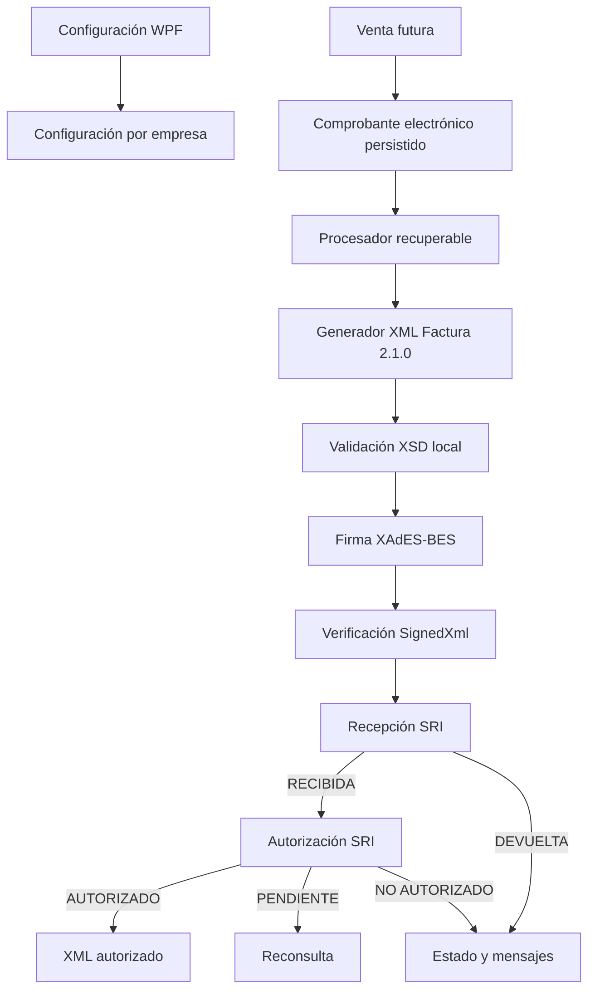

# FACTURACIÓN ELECTRÓNICA SRI V1

## Estado

Implementación técnica completada para **Factura electrónica 2.1.0**, nativa en .NET 10 y preparada para integrarse con Ventas V1.

La validación real en CELCER queda pendiente porque requiere un emisor habilitado, su certificado legal PKCS#12 y contraseña. No se ha inventado ni versionado material criptográfico real y no se ha enviado nada a Producción.

## Alcance

- Configuración SRI por empresa.
- Importación segura de certificados `.p12` y `.pfx`.
- Diagnóstico de configuración y conectividad no destructiva.
- Clave de acceso de 49 dígitos y módulo 11.
- XML de Factura versión 2.1.0.
- Validación local con XSD oficiales embebidos.
- Firma XAdES-BES 1.3.2 nativa con `SignedXml`.
- Recepción y autorización mediante SOAP.
- Persistencia de estados, mensajes y artefactos.
- Recuperación de trabajos interrumpidos e idempotencia por clave.
- Worker limitado a instalaciones `SERVIDOR`.

Fuera de V1: Ventas/POS, RIDE PDF, correo/WhatsApp y los demás comprobantes electrónicos.

## Arquitectura



La lógica tributaria está fuera de WPF. Application contiene contratos y DTOs; Infrastructure contiene criptografía, EF, filesystem y SOAP; Desktop contiene navegación, ViewModel y vistas.

## Componentes previos reutilizados

- `Empresa`, `Establecimiento`, `PuntoEmision` y sus relaciones multiempresa.
- `FacturacionElectronica` como configuración por empresa.
- `SecuencialComprobante` y catálogos de ambiente, emisión, comprobante y estados.
- `Factura`, detalles, impuestos, formas de pago y `Tercero` como modelo de integración futura.
- `ComprobanteElectronico`, eventos, worker, sesión, permisos y auditoría.
- Directorio administrado de documentos definido por `KONTAXPRO_DOCUMENTS_PATH`.

No se crearon estructuras paralelas de empresa, establecimientos, puntos, sesión, permisos o auditoría.

## Configuración por empresa

La vista tiene una sola entrada de navegación: **SRI y Tributación / Configuración SRI**. La opción se oculta cuando el usuario no posee ninguno de los permisos SRI admitidos y el servicio vuelve a comprobar empresa, usuario y permiso en cada operación. Respeta los recursos dinámicos Light/Dark existentes.

Permite:

- seleccionar PRUEBAS o PRODUCCIÓN;
- habilitar/deshabilitar la emisión electrónica;
- importar/cambiar el certificado;
- administrar la numeración inicial por establecimiento, punto de emisión,
  comprobante y ambiente;
- ver titular, emisor, serial y vigencia;
- comprobar requisitos de empresa, establecimiento, punto, secuencial y certificado;
- probar conectividad a los WSDL de recepción y autorización sin emitir documentos.

El cambio a Producción exige permiso y confirmación explícita. El diagnóstico de red consulta únicamente `?wsdl` mediante GET.

El RUC del proveedor del software no forma parte de la configuración ni se inyecta como información adicional privada. El XML contiene únicamente los datos tributarios y campos adicionales requeridos por la operación.

La pantalla cancela y recarga su estado cuando cambia la empresa o el establecimiento activo. Las ediciones usan concurrencia optimista PostgreSQL `xmin`: una versión desactualizada no sobrescribe cambios de otro usuario.

## Certificado y secretos

La validación comprueba:

- PKCS#12 legible y contraseña correcta;
- certificado con clave privada RSA;
- RSA de al menos 2048 bits;
- uso de firma/no repudio cuando la extensión está presente;
- fecha de inicio y caducidad;
- titular, emisor, serial e identificación del titular;
- coincidencia obligatoria con el RUC empresarial;
- vigencia local y estado de revocación mediante la validación X509 del sistema operativo.

La cadena se usa internamente como apoyo para consultar CRL/OCSP, pero no es un requisito visible ni obliga a instalar certificados en Windows. Se inspecciona cada `X509ChainStatus` para diferenciar:

- `Revoked`: revocación confirmada y bloqueo del certificado;
- `UntrustedRoot` y `PartialChain`: información técnica interna que no bloquea la configuración ni la firma;
- `RevocationStatusUnknown` y `OfflineRevocation`: revocación temporalmente no comprobada;
- construcción completa sin estados de error: certificado no revocado según CRL/OCSP.

La política funcional es:

```text
Vigente + no revocado = válido
Vigente + CRL/OCSP inaccesible = utilizable con advertencia
Revocado = no utilizable
```

Una falla de red o una cadena no instalada en Windows nunca se convierte en “revocado” ni en “comprobado como no revocado”. La fecha de revocación se muestra únicamente cuando una fuente confiable la proporciona; `X509Chain` normalmente confirma el estado sin informar esa fecha.

Al abrir el PKCS#12 se cargan también los certificados intermedios incluidos en el archivo y se entregan al motor X509 como almacén auxiliar. Esto mejora la consulta de revocación sin modificar el almacén global de certificados de Windows. El diagnóstico visible muestra vigencia y revocación, no el estado de confianza local de la cadena.

El certificado solo puede importarse, leerse o eliminarse en una instalación `SERVIDOR`. Certificado y contraseña se protegen por separado mediante Windows DPAPI con alcance del usuario de servicio (`CurrentUser`), entropía derivada del propósito y prohibición de UI. En PostgreSQL solo se guarda una referencia administrada y metadatos no secretos. Los buffers temporales sensibles se limpian cuando es posible.

La escritura usa un directorio temporal y una promoción atómica. Si la validación o persistencia falla, se elimina el nuevo material; luego de confirmar el reemplazo se limpia el anterior. Cada referencia se valida contra la empresa y el tamaño máximo admitido es 5 MB.

La comprobación online se ejecuta fuera del hilo de UI, admite cancelación y limita la recuperación de CRL/OCSP a 15 segundos. Los resultados confirmados se reutilizan durante seis horas; un estado desconocido solo se conserva cinco minutos para permitir reintentos tempranos. El botón **Verificar** fuerza una consulta nueva.

Antes de cada firma, el flujo real del worker vuelve a pasar por el mismo validador. Las comprobaciones locales siempre se repiten y la consulta online reutiliza el resultado reciente, evitando una llamada externa por cada comprobante. FirmaEC queda como posible respaldo futuro, no como dependencia rígida: KONTAXPRO nunca envía el PKCS#12, contraseña ni clave privada a servicios externos.

Ruta conceptual:

```text
<KONTAXPRO_DOCUMENTS_PATH>/facturacion-electronica/empresa-{id}/certificado-{uuid}/
  cert.bin
  secret.bin
```

Nunca se registra la contraseña, el binario PKCS#12, la clave privada ni el XML completo en logs.

## Establecimientos, puntos y secuenciales

Se usan los maestros existentes. El asignador valida en PostgreSQL la pertenencia:

```text
Empresa → Establecimiento → Punto de emisión
```

La pantalla separa esta responsabilidad en la pestaña **Numeración de
comprobantes**. Solo aparecen los establecimientos autorizados para el usuario
y las filas del ambiente seleccionado. Por cada combinación muestra:

- establecimiento y punto de emisión;
- tipo de comprobante;
- último secuencial emitido;
- próximo número completo con formato `EEE-PPP-NNNNNNNNN`;
- estado `INICIAL` o `EN USO`.

La misma pestaña administra los puntos de emisión del establecimiento:

- presenta tanto activos como inactivos y distingue el preferido del usuario;
- sugiere `100` para migraciones y, si ya existe, el siguiente código libre;
- acepta códigos numéricos `001..999` y normaliza ceros a la izquierda;
- permite modificar el nombre interno del punto sin alterar su código ni sus
  secuenciales;
- ofrece dos modalidades explícitas de creación:
  - **Punto nuevo**: exige confirmación de que el código nunca fue usado en otro
    sistema e inicializa en cero todos los comprobantes y ambientes;
  - **Continuar existente**: registra el último número realmente emitido por
    cada tipo de comprobante, de forma independiente para Pruebas y Producción;
- en continuidad, la opción `Emitió` diferencia un último secuencial real de la
  ausencia de emisiones; una combinación sin emisiones se conserva en cero;
- el servidor exige la matriz completa de tipos y ambientes activos, rechaza
  combinaciones repetidas, faltantes o valores fuera de `0..999999998`;
- permite seleccionar el punto preferido del establecimiento activo;
- nunca elimina puntos: al inactivar conserva historial y numeraciones;
- impide inactivar el único punto activo y reasigna preferencias al siguiente
  punto disponible cuando corresponde.

Creación, continuidad, cambio de nombre, preferencia y cambios de estado vuelven
a validar permiso, empresa y establecimiento autorizado en Infrastructure. Las mutaciones son
transaccionales, bloquean el punto cuando corresponde y generan auditoría
append-only. No fue necesaria otra tabla ni migración: se reutilizan
`puntos_emision`, `secuenciales_comprobantes` y
`usuarios_configuracion_empresa`.

El usuario ingresa el **último número ya emitido**; KONTAXPRO presenta y
confirma el próximo antes de guardar. El valor permitido es `0..999999998`.
La configuración inicial puede corregirse mientras KONTAXPRO todavía no haya
creado un comprobante electrónico para esa combinación. Desde la primera
emisión queda bloqueada en esta pantalla para evitar duplicidades o retrocesos.

La escritura se ejecuta en una transacción serializable, bloquea la fila con
`FOR UPDATE`, compara el valor originalmente leído y vuelve a comprobar
empresa, establecimiento autorizado y permiso. Un cambio concurrente se
rechaza y obliga a recargar. Cada modificación genera auditoría append-only
`SRI_CONFIGURACION_SECUENCIAL`, sin datos personales.

El secuencial se asigna con un único `UPDATE ... RETURNING` transaccional filtrado por empresa, establecimiento, punto, tipo de comprobante y ambiente. No usa `MAX + 1`; PostgreSQL serializa la actualización de la fila.

La combinación de emisión queda protegida además por el índice único parcial:

```text
(punto_emision_id, tipo_comprobante_id, tipo_ambiente_id, secuencial)
```

## Clave de acceso

`GeneradorClaveAccesoSri` compone y valida los 49 dígitos:

```text
fecha + tipo comprobante + RUC + ambiente + establecimiento + punto
+ secuencial + código numérico + tipo emisión + dígito módulo 11
```

El código numérico usa `RandomNumberGenerator`; en pruebas puede proporcionarse de forma determinista. Se validó contra el vector oficial de módulo 11 y una clave publicada por el SRI.

## XML de Factura

`GeneradorXmlFacturaSri` construye XML con APIs XML de .NET, nunca concatenando strings. Garantiza:

- UTF-8 sin BOM;
- `CultureInfo.InvariantCulture`;
- orden estricto de elementos;
- redondeos/formato decimal;
- datos de emisor, comprador, detalles, impuestos, descuentos, pagos e información adicional;
- cédula, RUC, pasaporte, exterior y consumidor final según el tipo recibido;
- campos adicionales genéricos;
- versión `2.1.0` e `id="comprobante"`.

El adaptador desde `Factura` reutiliza snapshots tributarios de detalles e impuestos, formas de pago, `EmpresaTercero`, establecimiento y punto. Facturación electrónica no modifica inventario, caja, cartera ni contabilidad.

## XSD y seguridad XML

Los recursos oficiales se incluyen embebidos:

- `factura_V2.1.0.xsd` del paquete oficial del SRI;
- `xmldsig-core-schema.xsd` de W3C.

La validación es local, con DTD prohibido, resolución externa deshabilitada y límite de tamaño. Los errores XSD invalidan el documento. Las advertencias esperadas por el contenido XAdES flexible dentro de `ds:Object` no se convierten en falsos errores.

## Firma XAdES-BES

La firma utiliza:

- XAdES 1.3.2;
- RSA-SHA1 y SHA1 por compatibilidad obligatoria del esquema SRI;
- canonicalización C14N;
- transformación enveloped sobre el comprobante;
- referencias internas a `#comprobante`, `KeyInfo` y `SignedProperties`;
- digest del certificado y `IssuerSerial`;
- certificado X509 y clave pública RSA en `KeyInfo`.

Se rechazan identificadores duplicados, referencias externas y documentos ya firmados. La firma generada pasa tanto la verificación especializada como `SignedXml.CheckSignature` estándar. Modificar la factura, `SignedProperties` o `KeyInfo` invalida la firma.

## SOAP SRI

Clientes separados atienden recepción y autorización. Los endpoints están centralizados por ambiente, deben usar HTTPS, puerto estándar y el dominio oficial exacto: `celcer.sri.gob.ec` para pruebas y `cel.sri.gob.ec` para producción. No se desactiva TLS ni se instalan validadores permisivos. El diagnóstico exige un documento WSDL XML real, limita su tamaño y prohíbe DTD/resolución externa.

Estados interpretados:

- recepción: `RECIBIDA`, `DEVUELTA`;
- autorización: `AUTORIZADO`, `NO_AUTORIZADO`, `PENDIENTE` (`PPR` y `EN PROCESO`).

Se preserva cada mensaje SRI con identificador, mensaje, información adicional y tipo. Se distinguen cancelación, timeout, HTTP temporal, SOAP Fault, respuesta vacía y XML SOAP inválido.

Las trazas incluyen acción, HTTP, duración y `CorrelationId`; el procesador añade empresa, comprobante, clave, ambiente y estados. No incluyen XML ni secretos.

## Persistencia, idempotencia y recuperación

Estados disponibles:

```text
PENDIENTE → PROCESANDO → GENERADO → FIRMADO → RECIBIDO
                                            └→ DEVUELTO
RECIBIDO → PENDIENTE_AUTORIZACION → AUTORIZADO | NO_AUTORIZADO
cualquier etapa recuperable → ERROR_TECNICO
validación definitiva → ERROR
```

Los mensajes del SRI se guardan individualmente en `comprobantes_electronicos_eventos`. También se registran eventos de generación, firma y errores sin datos sensibles.

Los artefactos no se duplican en PostgreSQL. Se escriben de manera atómica en almacenamiento administrado:

```text
facturacion-electronica/documentos/empresa-{id}/{ruc}/{clave}/
  generado.xml
  firmado.xml
  autorizado.xml
  ride.pdf                 # reservado para una fase futura
```

Se conservan referencias y marcas temporales separadas. Un comprobante `AUTORIZADO` es terminal. Tras un envío incierto se consulta primero por la misma clave antes de reenviar. Nunca se genera otra clave o secuencial durante un reintento.

El scheduler inicia automáticamente el worker al arrancar una instalación `SERVIDOR`, ejecuta un ciclo inmediato y continúa con intervalo configurable. Una instalación `CLIENTE` nunca procesa comprobantes localmente. El worker solo reclama comprobantes de empresas con facturación electrónica habilitada y certificado configurado, recupera reclamos abandonados después de 15 minutos y clasifica errores:

- transitorios: red, timeout, HTTP y filesystem → `ERROR_TECNICO`;
- definitivos: XML, XSD, certificado, firma o datos inválidos → `ERROR`.

No se intenta crear una transacción distribuida entre PostgreSQL y SRI.

## Base de datos

Migración inicial consolidada:

```text
20260816223009_InitialCreate
```

Cambios reales:

- metadatos y referencia segura del certificado en `s_configuracion.facturacion_electronica`;
- empresa/establecimiento/punto/secuencial/version XML en `s_facturacion_electronica.comprobantes_electronicos`;
- estados de recepción/autorización, intentos y última consulta;
- referencias separadas a XML generado, firmado y autorizado;
- FKs compuestas para aislamiento de empresa/establecimiento/punto;
- índice único parcial de emisión;
- checks de intentos y rango de secuencial.

La migración está aplicada en la base Development configurada y EF informa que la base está actualizada.

## Permisos y auditoría

Permisos estructurales:

- `SRI_CONFIGURAR_FACTURACION`
- `SRI_CAMBIAR_CERTIFICADO`
- `SRI_CAMBIAR_AMBIENTE`
- `SRI_ADMINISTRAR_SECUENCIALES`
- `SRI_EJECUTAR_DIAGNOSTICO`

Los permisos no son decorativos: lectura, diagnóstico, configuración, ambiente,
certificado y numeración se autorizan nuevamente en Infrastructure contra la
empresa activa y, cuando corresponde, contra los establecimientos autorizados
del usuario. La pestaña de numeración solo aparece con
`SRI_ADMINISTRAR_SECUENCIALES`. No es posible habilitar la emisión sin nodo
servidor, worker activo, RUC válido, establecimiento y punto activos,
secuencial del ambiente, endpoints oficiales y certificado válido/accesible.

Los cambios de ambiente/configuración, certificado y numeración se auditan
dentro de la transacción de la mutación. La auditoría identifica usuario,
empresa y establecimiento cuando corresponde, sin contraseña, ruta física ni
datos criptográficos.

## Pruebas

La suite nueva cubre:

- clave de 49 dígitos, módulo 11, vector oficial y entradas inválidas;
- código numérico de ocho dígitos;
- factura válida, obligatorios, orden, caracteres, descuentos, impuestos, pagos y XXE/DTD;
- PKCS#12 generado en memoria, contraseña, clave privada, vigencia y RUC;
- XAdES válido, verificación estándar, alteraciones e IDs duplicados;
- recepción y autorización fake, todos los estados, mensajes, fault, HTTP 500, timeout y respuesta vacía;
- diagnóstico WSDL no destructivo;
- apertura de la vista WPF, resolución desde el contenedor DI real y configuración inicial para empresas sin registro SRI;
- flujo integral simulado hasta `AUTORIZADO` y persistencia de artefactos;
- DPAPI y separación por propósito;
- aislamiento de permisos por empresa, permiso específico para cambio real de ambiente y rechazo de habilitación incompleta;
- concurrencia optimista, contexto exacto de establecimiento/punto y bloqueo de importación en nodos cliente;
- bloqueo de diagnóstico y guardado frente a establecimientos no autorizados;
- separación visual entre ambiente guardado y cambios aún pendientes;
- permiso, aislamiento por establecimiento, actualización concurrente,
  auditoría y bloqueo de numeraciones que ya están en uso;
- creación de puntos, normalización y duplicidad de código, generación de
  secuencias, preferencia e inactivación sin pérdida histórica;
- allowlist de endpoints oficiales y ciclo de vida del scheduler SERVIDOR/CLIENTE.

Resultado final local:

```text
dotnet build KONTAXPRO.slnx --configuration Release
0 advertencias, 0 errores

Pruebas Facturación electrónica: 69/69 aprobadas
Suite completa: 472 aprobadas, 8 omitidas, 0 fallidas
```

Las pruebas de certificado sintético sustituyen exclusivamente la confianza de cadena dentro del test; la implementación productiva conserva validación estricta del sistema operativo. Las pruebas relacionales siguen requiriendo `KONTAXPRO_TEST_CONNECTION_STRING` y una base dedicada cuyo nombre termine en `_test`, tal como exige `AGENTS.md`.

## CELCER

Estado real:

```text
Prueba con certificado real: NO EJECUTADA
RECIBIDA real: NO CONFIRMADA
AUTORIZADO real: NO CONFIRMADO
```

Motivo: el repositorio no contiene —ni debe contener— certificado legal, contraseña y datos de un emisor habilitado. El botón **Probar SRI** comprueba conectividad, pero deliberadamente no emite.

Procedimiento pendiente:

1. Abrir KONTAXPRO en el equipo configurado como `SERVIDOR` y seleccionar una empresa emisora habilitada.
2. Mantener el ambiente PRUEBAS.
3. Importar su `.p12/.pfx` mediante la pantalla; la contraseña se ingresa solo en el diálogo seguro.
4. Confirmar diagnóstico **LISTO PARA FACTURAR** y conectividad de ambos servicios.
5. Crear una Factura de prueba desde la futura integración controlada de Ventas/CELCER.
6. Verificar `RECIBIDA`, luego `AUTORIZADO`, mensajes y `autorizado.xml`.
7. No cambiar a Producción hasta concluir la certificación y revisión tributaria.

## Integración futura con Ventas

Ventas V1 deberá confirmar su operación local, asignar secuencial de manera atómica y crear un `ComprobanteElectronico` con la misma empresa, establecimiento, punto, ambiente, origen y clave. A partir de allí el procesador es recuperable y no requiere que la UI conozca XSD, certificado, XAdES o SOAP.

La venta coordinará inventario, cartera/caja y contabilidad. El motor SRI solo transforma, firma, comunica y conserva el estado electrónico.

## Pendientes reales

- Ejecutar y documentar una autorización real en CELCER con credenciales del emisor.
- Integrar la creación del comprobante desde Ventas V1.
- Implementar RIDE y entrega por correo en fases posteriores.
- Ejecutar las pruebas relacionales con `KONTAXPRO_TEST_CONNECTION_STRING` cuando exista una base dedicada `_test`.
