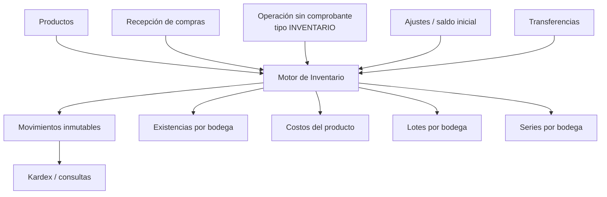

# INVENTARIO / KARDEX V1

## 1. Objetivo y alcance

Inventario/Kardex V1 es el subsistema central que registra hechos físicos,
mantiene la proyección actual de existencias y conserva el costo histórico de
KONTAXPRO. La UI simplifica la consulta y las operaciones, mientras que las
reglas de integridad permanecen en Application/Infrastructure.

El alcance implementado incluye:

- existencias y reservas por producto y bodega;
- cantidades comerciales convertidas a unidad base;
- costo promedio ponderado empresarial;
- lotes, caducidad y series por bodega;
- compras y operaciones sin comprobante inventariables;
- ajustes positivos y negativos;
- saldos iniciales controlados;
- transferencias atómicas entre bodegas;
- reversos inmutables de recepciones y operaciones sin comprobante;
- Kardex valorado, paginado y filtrable;
- conciliación técnica entre historial, existencias, lotes y series;
- pantalla principal con KPI, detalle, Kardex y editores operativos.

Ventas, devoluciones y reservas comerciales no se implementan en esta versión,
pero el motor ya admite salidas, trazabilidad de origen y series reservadas.

## 2. Arquitectura



Responsabilidades:

- `IInventoryService` / `InventoryService`: entradas, ajustes, control de
  lotes/series, conversiones, saldo inicial y primitivas internas del motor.
- `IInventoryTransferService` / `InventoryTransferService`: transferencia
  completa en una transacción serializable.
- `IInventoryQueryService` / `InventoryQueryService`: catálogo, KPI, detalle,
  Kardex paginado y reconciliación sin modificar estado.
- `InventoryReversalProcessor`: reverso interno compartido por operaciones que
  ya controlan su propia transacción funcional.
- `InventoryViewModel`: orquestación de UI; no accede a EF ni contiene SQL.

Las operaciones compuestas comparten el mismo `KontaxDbContext` y la misma
transacción que su documento funcional. No existe un segundo commit entre el
documento y el movimiento físico.

## 3. Entidades y tablas utilizadas

No se creó un modelo paralelo. Se reutilizan las estructuras oficiales:

| Esquema / tabla | Responsabilidad |
|---|---|
| `s_inventario.productos` | Maestro y reglas de control |
| `productos_presentaciones` | Cantidad comercial y factor histórico |
| `productos_existencias` | Proyección actual producto + bodega |
| `productos_costos` | Último precio, costo efectivo y promedio |
| `productos_lotes` | Identidad global del lote para el producto |
| `productos_lotes_existencias` | Stock del lote por bodega |
| `productos_series` | Identidad, lote, bodega y estado de la serie |
| `movimientos_inventario` | Cabecera inmutable y origen funcional |
| `movimientos_inventario_detalles` | Cantidades, costo y snapshots |
| `movimientos_inventario_detalles_lotes` | Snapshot del lote |
| `movimientos_inventario_detalles_series` | Trazabilidad de series |
| `ajustes_inventario` y detalles | Documento funcional de ajuste |
| `transferencias_inventario` y detalles | Documento funcional de traslado |

`StockDisponible` no se persiste: se deriva como
`StockActual - StockReservado`.

## 4. Flujo de movimientos

Todo movimiento confirmado conserva:

- empresa, bodega, usuario y fecha efectiva;
- tipo de movimiento y naturaleza (`ENTRADA`/`SALIDA`);
- tipo e identificador de origen;
- documento, referencia y observación;
- presentación, factor histórico y cantidad base;
- stock anterior/nuevo;
- costo unitario, costo total y promedio anterior/nuevo;
- lotes y series involucrados.

El movimiento es historia; `productos_existencias` y las existencias por lote
son la proyección de consulta. Ambas se actualizan dentro de la misma
transacción.

## 5. Existencias, presentaciones y costos

La existencia se mantiene siempre en unidad base:

```text
cantidad_base = cantidad_presentación × factor_conversión
```

El detalle conserva también la cantidad comercial, presentación y factor
aplicado, por lo que cambios posteriores del maestro no alteran el Kardex.

Para una entrada con stock empresarial positivo se utiliza el costo total real
de la línea:

```text
nuevo_promedio =
  (stock_empresa_anterior × promedio_anterior + costo_total_entrada)
  / (stock_empresa_anterior + cantidad_base_entrada)
```

Si el stock anterior es cero o negativo, el nuevo promedio toma el costo
unitario real de la entrada. El stock negativo representa unidades vendidas
antes de registrar su ingreso y no se pondera como una existencia positiva;
esto evita costos negativos o artificialmente altos al recuperar stock. Las
salidas conservan el promedio vigente y no lo recalculan. Las transferencias
preservan costo y no simulan una compra.

Los servicios (`maneja_inventario = false`) no llegan al motor.

## 6. Lotes, caducidad y series

Una entrada controlada por lote exige que la suma de lotes sea exactamente la
cantidad base. La combinación producto + número de lote es única y su stock se
mantiene separadamente por bodega. Elaboración y caducidad se conservan como
fechas civiles.

La alerta por caducidad se deriva de fecha de caducidad, fecha actual de
Ecuador, configuración del producto y días de anticipación; no se persiste un
estado redundante.

Los productos serializados requieren cantidad base entera y exactamente una
serie por unidad. La serie es única por producto y conserva lote, bodega y
estado. Una salida o transferencia exige series concretas disponibles en la
bodega origen.

Estas invariantes también se validan en el motor compartido, no solamente en
los editores: las filas de serie vacías y los lotes repetidos dentro de una
misma entrada son rechazados desde cualquier módulo consumidor.

## 7. Compras

La compra registrada no mueve stock. El hecho físico ocurre al confirmar una
recepción:

```text
Compra → Recepción confirmada → Movimiento COMPRA → Existencias/costo
```

El origen de inventario es `RECEPCION_COMPRA` y `OrigenId` es el identificador
de la recepción. Esta decisión permite múltiples recepciones parciales de una
misma compra y, simultáneamente, impide aplicar dos veces la misma recepción.

El motor recibe desde Compras el costo efectivo ya calculado, factor histórico,
bonificación, lotes y series. No vuelve a calcular reglas tributarias ni
contables.

Al anular una recepción, `InventoryReversalProcessor` valida que no existan
movimientos posteriores, reservas, cambios de costo, lotes usados o series no
disponibles. Luego genera un contramovimiento y conserva el original.

## 8. Operaciones sin comprobante

Solo las operaciones de tipo `INVENTARIO` generan Kardex. Los gastos no lo
hacen. La operación inventariable usa origen `OPERACION_SIN_SUSTENTO` y enlaza
el movimiento al identificador funcional después de crear la cabecera.

Su anulación utiliza el mismo procesador central de reversos que Compras. Caja,
banco y contabilidad siguen siendo efectos separados, pero se confirman o
revierten dentro de la transacción de la operación.

## 9. Ajustes

Los ajustes son documentos funcionales diferenciados:

- `AJUSTE_ENTRADA`: aumenta stock y puede actualizar el costo promedio;
- `AJUSTE_SALIDA`: exige stock disponible, usa el costo promedio vigente y no
  lo recalcula.

Requieren empresa, establecimiento, bodega, usuario, fecha, motivo catalogado,
justificación y al menos una línea. El servicio verifica permiso y acceso al
establecimiento, incluso si la UI ya filtró la bodega.

La pantalla de Inventario permite registrar ambas variantes sobre el producto
seleccionado y captura lotes/series cuando el tipo de control lo exige.

## 10. Saldo inicial

El saldo inicial se identifica con tipo y origen `INVENTARIO_INICIAL`; no se
mezcla con ajustes. Requiere el permiso específico
`INVENTARIO_AGREGAR_ENTRADA_INICIAL`.

El motor rechaza completar inventario inicial si alguno de los productos de la
solicitud ya posee movimientos operativos distintos de inventario inicial. Así
se evita reescribir conceptualmente una historia que ya empezó.

## 11. Transferencias

Una transferencia crea un documento funcional y dos movimientos relacionados:

```text
Bodega origen ── TRANSFERENCIA_SALIDA ──┐
                                        ├─ misma transacción serializable
Bodega destino ─ TRANSFERENCIA_ENTRADA ─┘
```

Se valida:

- empresa y acceso del usuario a ambos establecimientos;
- bodegas activas y diferentes;
- presentación perteneciente al producto y factor positivo;
- stock disponible suficiente;
- lotes explícitos y disponibles;
- series concretas disponibles;
- motivo obligatorio.

Los lotes conservan su identidad. Las mismas series cambian de bodega. El costo
promedio empresarial se conserva y no se actualizan último precio de compra,
ubicación ni stock mínimo.

## 12. Reversos e inmutabilidad

No se eliminan movimientos aplicados ni se cambian sus detalles. Un reverso:

1. bloquea si el original ya fue revertido;
2. bloquea si hay historia posterior del producto;
3. compara stock y costo actuales con el último snapshot;
4. verifica reservas, lotes y series;
5. restaura la proyección anterior;
6. crea detalles inversos en orden LIFO;
7. enlaza `movimiento_reverso_id` y marca el original como anulado.

El procesador compartido está integrado en anulaciones de recepciones de
compra, operaciones sin comprobante, ajustes e inventario inicial. Las
transferencias se revierten de forma atómica con una salida en la antigua
bodega destino y una entrada en la antigua bodega origen, incluyendo lotes y
series. No existe una acción de “eliminar movimiento”.

## 13. Multiempresa, permisos y auditoría

Todas las consultas y comandos reciben empresa y usuario. Las bodegas se
limitan a establecimientos autorizados mediante
`usuarios_empresas_establecimientos`. El servicio vuelve a verificar las
relaciones, sin confiar en los combos de la UI.

Permisos relevantes:

- `INVENTARIO_VER_KARDEX`
- `INVENTARIO_VER_COSTO`
- `INVENTARIO_AGREGAR_ENTRADA_INICIAL`
- `INVENTARIO_REGISTRAR_AJUSTE`
- `INVENTARIO_TRANSFERIR`
- `INVENTARIO_RECONCILIAR`
- `INVENTARIO_ANULAR_OPERACION`
- permisos ya existentes para lotes, series y conversión de control.

Transferencias generan un registro en la auditoría general. Los movimientos
conservan usuario, timestamps, origen y documento; Compras y Tesorería agregan
además su auditoría funcional.

## 14. Concurrencia e idempotencia

Entradas, ajustes, transferencias, recepciones y operaciones sin comprobante se
ejecutan con aislamiento `Serializable`. Los conflictos de serialización o
integridad se convierten en mensajes de negocio y ninguna tabla queda aplicada
parcialmente.

La migración `InventoryKardexV1Integrity` agrega:

- índice no único `(empresa_id, bodega_id, fecha_movimiento)` para consultas de
  Kardex;
- índice único `(empresa_id, origen_tipo_id, origen_id, bodega_id,
  tipo_movimiento_id)` para idempotencia física, filtrado a `origen_id > 0`
  para no bloquear cabeceras aún no enlazadas dentro de su transacción.

La recepción conserva además `OperacionUuid` único en Compras, aportando una
segunda barrera ante doble clic, timeout o reintento.

## 15. Consultas, Kardex y reconciliación

`InventoryQueryService` ejecuta búsquedas, filtros y paginación en PostgreSQL.
No carga el historial completo en memoria.

La pantalla principal muestra:

- KPI de productos, sin stock, stock bajo, por caducar y valor;
- búsqueda por código, nombre, marca, presentación y código de barras;
- filtro por bodega autorizada;
- stock actual, reservado, disponible, costo y valor;
- detalle por bodega, lotes, series y movimientos recientes;
- Kardex valorado con fechas, naturaleza y paginación;
- editores de saldo inicial, ajuste y transferencia;
- acción técnica de verificación de integridad.

La reconciliación parte de la unión entre historial y todas las proyecciones,
por lo que también detecta filas ausentes. Verifica:

- existencia distinta de la suma histórica de entradas menos salidas;
- stock global distinto de la suma de lotes por producto/bodega;
- stock distinto del número de series disponibles o reservadas.
- reservas generales distintas de las reservas por lote o por estado de serie.

Las consultas auxiliares de control y motivos exigen usuario y empresa. El
estado de control solo incluye bodegas de establecimientos autorizados. Los
costos, la valoración y los snapshots valorados se devuelven y muestran
únicamente con `INVENTARIO_VER_COSTO`.

Es diagnóstica: nunca “corrige” silenciosamente una diferencia.

## 16. UI y experiencia

`InventoryView` sigue el lenguaje visual de Productos y Compras:

- título con icono sólido Primary Dark;
- tarjetas KPI filtrables;
- controles y botones compartidos;
- paneles modales compactos;
- scrollbars y DataGrid del sistema;
- recursos dinámicos para Light/Dark;
- carga y búsqueda asincrónicas con cancelación/debounce;
- mensajes de negocio mediante `IMessageDialogService`.

Las entradas de fecha usan máscara `dd/MM/yyyy`. Cantidades y costos usan
`decimal`, nunca `double` ni `float`.

## 17. Relación con Productos y Contabilidad

Productos continúa mostrando existencias desde `productos_existencias` y
costos desde `productos_costos`, la misma proyección que mantiene el motor. La
creación de producto con inventario inicial y el ajuste desde edición reutilizan
las primitivas internas de Inventario; no existe un stock alterno.

Inventario registra únicamente el hecho físico. Compras y operaciones sin
comprobante siguen siendo responsables del asiento contable y de los efectos de
tesorería/CxP. El origen permite relacionar posteriormente documento,
movimiento y asiento sin contabilizar dos veces.

## 18. Pruebas y verificación

Pruebas automatizadas de Inventario cubren reglas de:

- unidad base, costo unitario y promedio ponderado;
- distribuciones de lote y caducidad;
- series completas, únicas y enteras;
- conversión de tipo de control;
- motivos de ajuste;
- validación de transferencias;
- metadatos EF de snapshots, índice de Kardex e idempotencia.

Existe una prueba PostgreSQL opt-in para comprobar que la migración esté al día
y ambos índices existan realmente. Requiere una base exclusiva terminada en
`_test` mediante `KONTAXPRO_TEST_CONNECTION_STRING`; no utiliza la base local
del desarrollador.

Estado al cierre:

- `dotnet build KONTAXPRO.slnx --no-restore`: correcto, 0 warnings, 0 errores;
- pruebas no PostgreSQL: 375 correctas;
- pruebas PostgreSQL: 7 omitidas al no estar configurada la variable opt-in;
- migración aplicada en Development a `localhost/kontax_desktop`.

## 19. Decisiones técnicas

1. Se mantuvo una proyección de existencias para rendimiento; el Kardex es la
   historia, no una consulta recalculada para cada pantalla.
2. El costo promedio es empresarial y la existencia es por bodega, coherente
   con `productos_costos` existente.
3. Los casos de uso compuestos invocan primitivas internas con su contexto, en
   lugar de abrir una transacción independiente que pudiera dejar efectos
   parciales.
4. Los reversos exigen que el movimiento sea el último hecho de sus productos.
   Es una política V1 conservadora que garantiza restaurar snapshots de costo.
5. Recepción de compra es el origen físico idempotente; Compra sigue siendo el
   documento económico.

## 20. Pendientes reales para Ventas

- conectar la confirmación de venta a la salida central de Inventario;
- implementar reservas y liberación de stock para workflows de venta;
- selector FEFO/FIFO asistido para lotes, sin sustituir la decisión explícita;
- selección de series en venta y transición `DISPONIBLE → VENDIDA`;
- reverso de salida por devolución de venta;
- pruebas PostgreSQL de concurrencia A/B con una base `_test` disponible;
- logging estructurado persistente cuando se incorpore el proveedor de logging
  general del proyecto.

Estas extensiones no requieren reconstruir existencias, costos ni Kardex.
